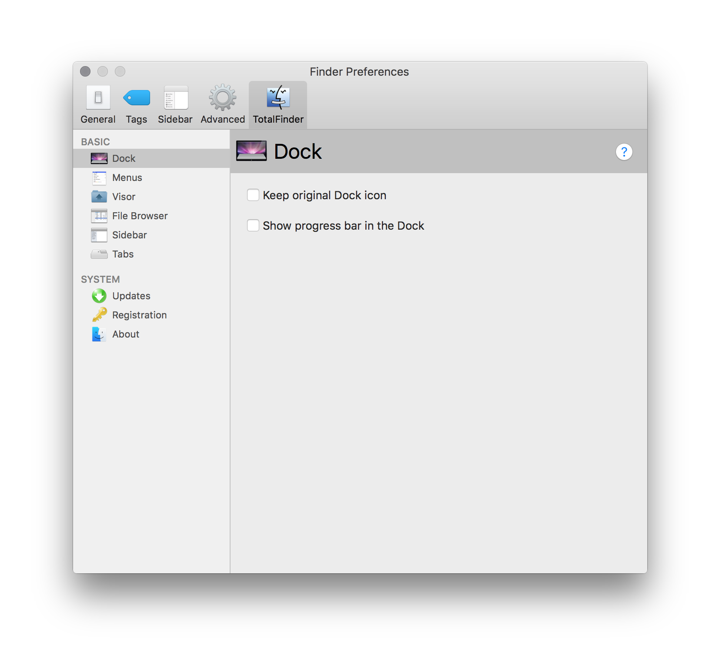
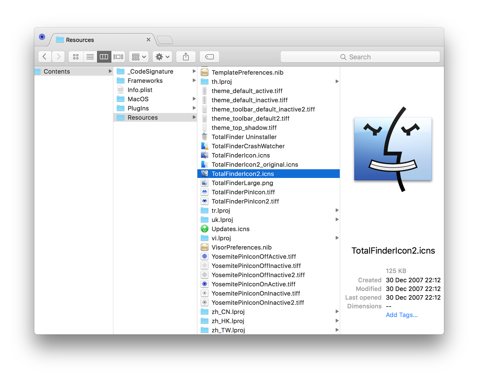
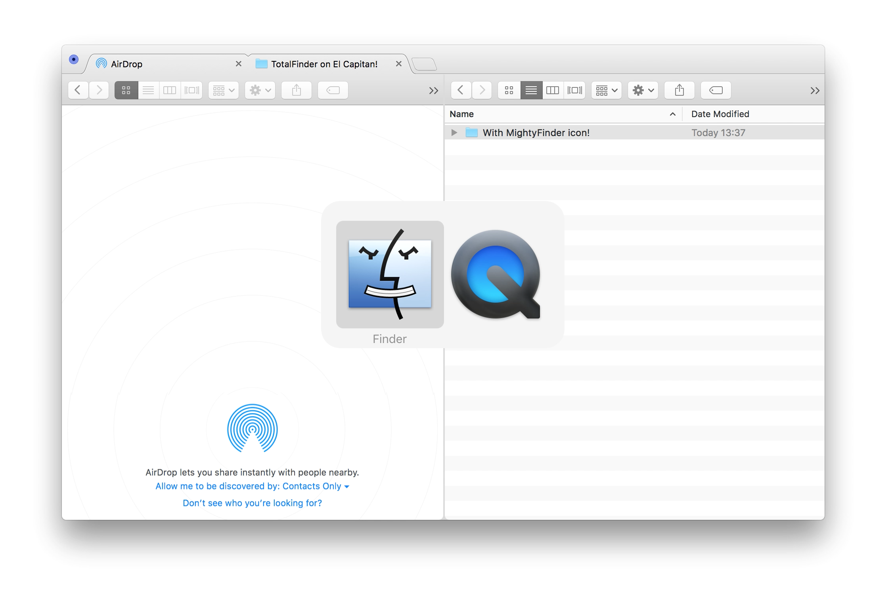

Recently I had to upgrade Xcode from 7.2 to 7.3 which in turn forced me to upgrade from OSX
Mavericks to El Capitan. I had been holding out for as long as I could to upgrade to El Capitan
because my all time favourite OSX app [TotalFinder][totalfinder} would not work
[without partially compromising][tf-integrity] Apple's new [SIP anti-malware mechanism][apple-sec].

In an [exchange][4] on Twitter [@BinaryAge][5] advised me that [there was now a way][6] to run
TotalFinder without compromising SIP on OSX El Capitan. The process made me sweat on my fingers but
ultimately it worked!

There was now only one missing piece: to get the MightyFinder icon back! I've been using that icon
as a replacement for Finder for almost a decade. If you'd like to get it you can still download it
from [Max Rudberg's site][7]. Be sure to check out the [video][8] that originated the icon idea.

It took me some trial and error to get a custom icon to work with TotalFinder but here is what
worked for me. It's mostly based on this post [here][9]. At the time of writing I was using
TotalFinder version 1.7.12. This assumes you have successfully completed [this guide][6].

<strong>2016.04.15 Update/Warning</strong>: @BinaryAge [mentioned on Twitter][10] they do not
recommend the below approach because it breaks TotalFinder's code signature. The possibility was
however mentioned to include a hidden feature to more easily use a custom icon in a future
TotalFinder release. Fingers crossed!

1. In TotalFinder preferences, make sure "Keep original Dock icon" is unchecked.

2. Go to: `/System/Library/ScriptingAdditions/`, right click on *TotalFinder.osax* and pick
*Show Package Contents*

3. Drill further: <em>/System/Library/ScriptingAdditions/TotalFinder.osax/Contents/Resources/</em> and open the package contents of <em>TotalFinder.bundle</em>

4. Drill again further:
/System/Library/ScriptingAdditions/TotalFinder.osax/Contents/Resources/TotalFinder.bundle/Contents/Resources/`

5. The icon you have to replace is the file <strong>TotalFinderIcon2.icns</strong>. Replace it with
your desired icon.

6. Restart TotalFinder. One way is Cmd + Alt + Esc -> Relaunch Finder. Another is typing into
Terminal: `killall Finder`

7. Finder will restart, give it a few seconds then run TotalFinder from the Applications folder.

Voilà! If everything worked you should now have TotalFinder running on OSX El Capitan with a custom
icon. Hope it will help someone.

[totalfinder]: http://totalfinder.binaryage.com/
[tf-integrity]: http://totalfinder.binaryage.com/system-integrity-protection
[apple-sec]: https://developer.apple.com/library/mac/documentation/Security/Conceptual/System_Integrity_Protection_Guide/Introduction/Introduction.html
[4]: https://twitter.com/jonrh/status/720052256771547137
[5]: https://twitter.com/binaryage
[6]: http://totalfinder.binaryage.com/system-osax
[7]: http://www.maxrudberg.com/
[8]: http://www.dailymotion.com/video/x68k6z_free-animations-gates-vs-jobs_fun
[9]: http://discuss.binaryage.com/t/totalfinder-corrupted-after-icon-change-how-do-you-change-the-icon-then/1370
[10]: https://twitter.com/binaryage/status/720673757367369728