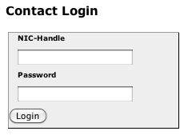

import Post from "../../components/Post";

<Post
  title="Registering a .is domain with Bluehost"
  date="February 23, 2011"
  metaDescription="How to set up a .is domain with Bluehost hosting. Most likely outdated."
>

{/* Todo: Maybe add pictures back once I've figured out Markdown images */}

After allot of thinking and procrastination I finally decided to acquire the <a href="http://jonrh.is.routing.yourhost.co">jonrh.is</a> domain. Setting things up wasn't without
its hurdles though. The thing is <a href="http://isnic.is">ISNIC</a>, the .is domain registrar,
doesn't accept <a href="http://bluehost.com">Bluehosts</a> DNS services. So this post is for those
few souls out there that might run into the same problem. This is by no means going to be an
extensive guide but merely what I did in the situation.

What you'll need:
<ul>
	<li>a registered .is domain</li>
	<li>a <a href="http://bluehost.com">Bluehost</a> account with a dedicated IP address</li>
</ul>

To grab a .is domain head over to <a href="http://isnic.is">ISNIC.is</a>, the process is as
straight forward as any online shopping. The next step is to make sure you have a dedicated IP
address for your Bluehost account. By default a dedicated IP address does cost extra, when this
was written it would put you back a $30/year. Note: I've heard that it's possible to do this
without a dedicated IP by utilizing the free services provided by <a href="http://zoneedit.com">zoneedit.com</a> but I was going anyway for a dedicated IP because I
wanted to implement SSL for my site so this guide will assume for a dedicated IP. So let's get our
hands dirty:

1. Log into <a href="https://www.isnic.is/y/site/login">your ISNIC profile</a>.

{/*  */}

2. My Page should be the default page. Select your domain from the list and select Web forwarding
 (*ísl*: Áframsending veffang).

{/*

*/}

3. Put your dedicated Bluehost IP into the IP field. Note only put the IP into the field and not
http://ip. If you do the latter you domain will only be a redirect to another site, but we'll want
Bluehost to recognize our domain.

{/*

*/}

4. Log into your Bluehost account. Scroll down in the cPanel and open Domain Manager under the Domains section.

{/*

*/}

5. Click "Assign a domain to your cPanel account". In Step 1 just input your .is domain. We took
care of Step 2 in step 3 of this guide. If Step 2 gives the same error message as in the picture
then you might have to try later as it might take some time for the ISNIC forward to take effect.
When successful Step 2 should say the domain was successfully verified because it pointed to the IP
of your Bluehost account. Pick "Parked Domain" in Step 3.

{/*

*/}

6. You're done!

As stated previously this is only a guide on how I did it, there are probably many more ways to
solve this. On the todo list is to get SSL to work with the parked domain but I'll probably
procrastinate that for another year.

</Post>