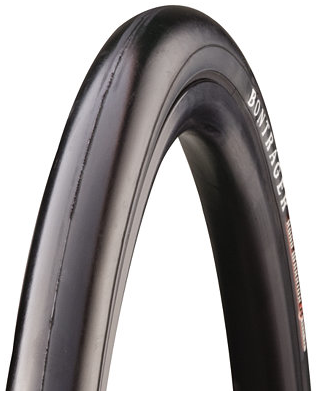
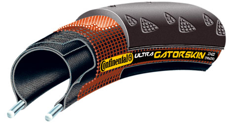

<!--
    Todo: The link to the scott_onzo.jpg image becomes a hashed string. This might be nontrivial
    to fix. The links below show how it can be done in JavaScript but I'm not sure how it would be
    done in Markdown.

    https://github.com/gatsbyjs/gatsby/blob/1.0/examples/image-processing/src/pages/index.js
    https://image-processing.gatsbyjs.org/
-->
Two years ago I started cycling on a regular basis and after a while it became evident to me that
there must have existed better suited tires than the [tractor grooved](./scott_onzo.jpg) ones that I
had on my mountain bike. My first slim bicycle tires where
[Bontrager Road Warrior 26″x1.5″](http://bontrager.com/model/00447). What those numbers mean is
that the tire measures 26 inches in diameter, which is pretty much all mountain bikes, and 1.5
inches in thickness when inflated. I did use them for about 1000km but in the end punctures were
becoming too frequent, or about once every 2 weeks (to put that in perspective I commute 8km per
day 5 days a week).

<!--

    

-->

<table style="text-align: left;">
    <tbody>
        <tr>
            <th>Pros</th>
            <th></th>
            <th>Cons</th>
        </tr>
        <tr>
            <td valign="top">
                <ul>
 	                <li>good traction</li>
 	                <li>cheap, $23 a piece</li>
 	                <li>low rolling resistance</li>
                </ul>
            </td>
            <td></td>
            <td valign="top">
                <ul>
 	                <li>very prone to punctures</li>
 	                <li>inflates to only about 60 psi</li>
                </ul>
            </td>
        </tr>
    </tbody>
</table>

My second slim tires where [Continental Ultra GatorSkin 26″x1.25″](http://www.conti-online.com/generator/www/de/en/continental/bicycle/themes/race/recetyres/ultra_gatorskin/ultragatorskin_en.html).
As of this writing I’ve put around 500km on them and so far no punctures or visual cuts on the
tires but one pinch flat. I’ve on many occasions rolled directly over broken glass on the street
and never achieved a puncture, where in the same situation the Road Warrior would have. The
Continental tires roll better than the Bontrager ones which I think can be attributed to its
slimmer width and higher pressure containment. I’ll have to mention though it was a nightmare to
put the tires on the first time. Two soar hands and 3 hours later I finally managed to pop them
on. In retrospect I learned
[the right technique](http://www.youtube.com/watch?v=9oFXewhx3BE&feature=fvw) just by that trial
and error. As mentioned earlier I’ve once had to change a flat tire on these but that change was
a lot smoother.

<table style="text-align: left;">
    <tbody>
        <tr>
            <th>Pros</th>
            <th></th>
            <th>Cons</th>
        </tr>
        <tr>
            <td valign="top">
                <ul>
 	                <li>good traction</li>
 	                <li>very puncture resistant</li>
 	                <li>lower rolling resistance</li>
 	                <li>90 psi containment</li>
                </ul>
            </td>
            <td></td>
            <td valign="top">
                <ul>
 	                <li>expensive, <a href="http://www.amazon.com/Continental-Ultra-Gatorskin-City-Trekking/dp/B000NGT2VY">around $40</a> a piece</li>
 	                <li>hard to put on the first time</li>
                </ul>
            </td>
        </tr>
    </tbody>
</table>

## Conclusion

If you’re only doing urban commuting and want to try out the benefits of slim tires but unsure if
it’s your thing, I definitely recommend the
[Bontrager Road Warrior](http://bontrager.com/model/00447) as a entry level tires. However there
is no question about it that the [Ultra Gatorskin](http://www.conti-online.com/generator/www/de/en/continental/bicycle/themes/race/recetyres/ultra_gatorskin/ultragatorskin_en.html)
tires are better than Bontrager Road Warrior. Although more expensive I firmly believe that
they’ll pay up multiple times in the long run when it comes to mileage. On top of that, if the
tires will maintain it’s excellent puncture resistance, allot of time and pain will be saved from
fixing flat tires.