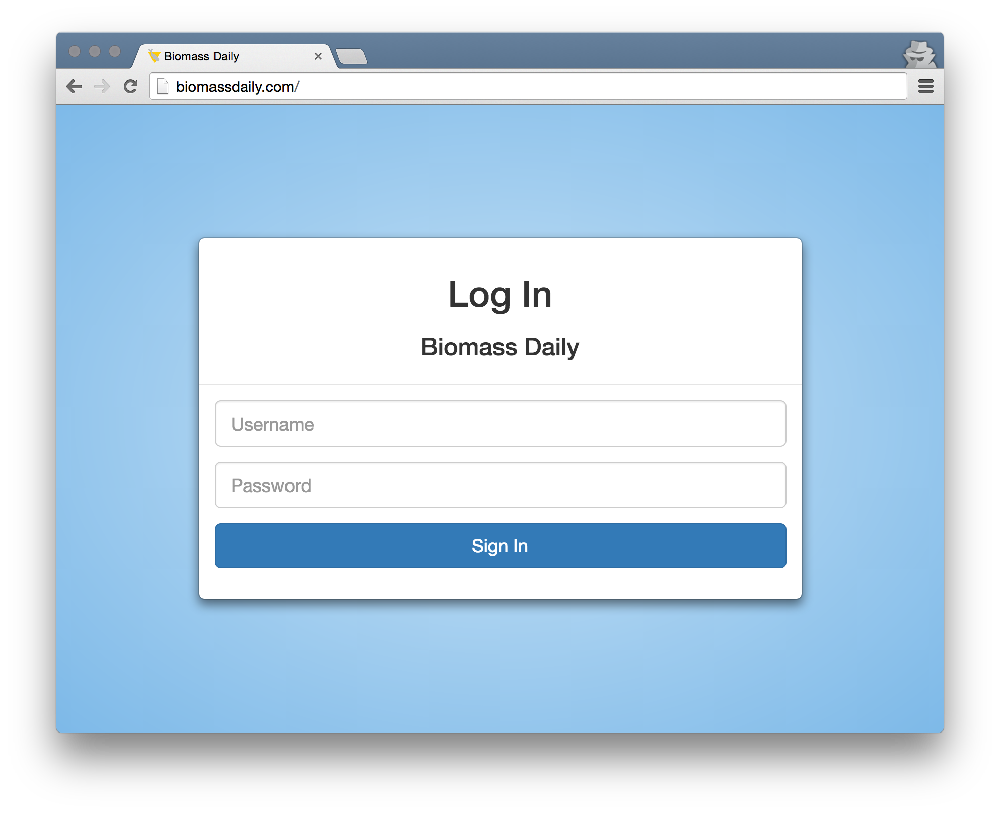
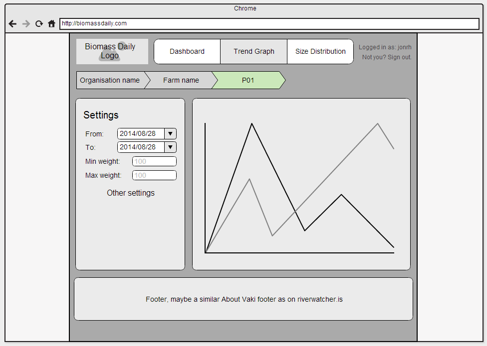
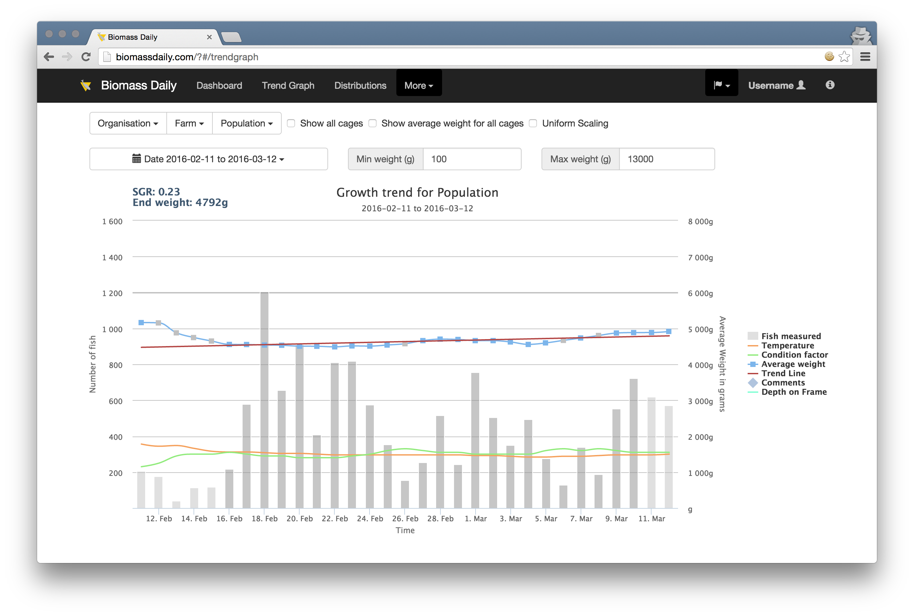

This is a retrospective and a stack overview (tools used) of a software project I worked on from
2014 to 2015.

**Summary**:

+ Jumped into the deep end of the JavaScript front-end pool
+ Created an SPA using React, Reflux, and Webpack
+ 13K lines of code, 70 components, 20 stores
+ Experience with React largely positive
+ Would pick [Elm][0] instead today

In August 2014 I started working as a software developer at [Vaki][1] (awesome workplace!), a
company that specialises in making hardware and software to count and estimate the weight of live
fish for the aquaculture industry. A pretty niche market but the industry is absolutely huge! The
job was to design and make a new dashboard website (Biomass Daily) to replace an older system.

I worked at Vaki for one year on this project and then took a sabbatical to do an MSc in Computer
Science at UCD, University College Dublin.


## Architectural decision

Initial plans were to go for ASP.Net but instead we went for a web service and a single page
architecture. There were two motives for this:

1. The speed of advancements in GUIs is getting faster and faster, particularly in the JavaScript
ecosystem. We didn't want to lock ourself too much in with ASP.Net. Going for a web service
underneath where we implement all the processing of raw data makes it easier to create and swap to
a new client in the future.

2. At the time of designing we were uncertain if we wanted to create an iOS and or Android version.
With a web service in place it's certainly an option at any time to add those.

Underneath we have an existing Microsoft SQL database and the company had good in-house knowledge
of C# so it made sense to have the web service written in C#.

For authentication we used [JSON Web Tokens][2] (JWT). It took me some time to grok it but
eventually it all clicked. We had good experience with JWT and really enjoy the simplicity of it.

More than a year later I'm very confident that these were the right decisions to make given the
circumstances. When this post was written I was in a course on Swift programming for iOS. For the
next few weeks I'll create an iOS app for the Biomass Daily system. Had we gone for a traditional
ASP.Net website that would not have been possible.




## JS framework/library selection

For the first 2 weeks I created a prototype of the site in jQuery. I had worked with jQuery before
and what I like about it is how fast and intuitively you can get stuff to work. But already in week
two I was starting to gravitate towards a fragile mutation spaghetti callback mess. It was now time
embark on finding a suitable front-end JavaScript framework or library. Oh boy.

For context, at this time I thought I had a pretty good grip of web development. I had worked with
HTML5, CSS, and programmed in JavaScript and jQuery before. I mean, how much more complicated could
it be learning a new JavaScript framework/lib, right? I started realising pretty fast
[I didn't know as much as I thought][3].

There were few vague requirements that I came up with. The project was going to be a long term one,
so picking an established framework was beneficial, more likely and easier to hire additional
talent. The site contains lots of graphs and reports with lots of input filters, many of them
shared between reports. Re-use was therefore a big factor.

I looked at a lot of frameworks/libs but the ones that stood out in my opinion were:

+ [Angular](https://angular.io/)
+ [Ractive.js](http://www.ractivejs.org/")
+ [Vue.js](http://vuejs.org/)
+ [Mithril](https://lhorie.github.io/mithril/)
+ [React](https://facebook.github.io/react/)


Ultimately we picked React with Vue in 2nd place and Mithril 3rd. The primary appeal of React was
being able to more easily reuse our filters (components). Additionally we had heard very good
things about React from really smart developers around us. In retrospect I think we did make the
right call. Vue has though grown and improved substantially so it would probably have been a good
bet as well. So now that we had decided on React it was time to learn the rest of the jungle
required to make React work.


### Bundler / Build Tool

For the project we used [JSX][4] to build components. JSX did take some time getting used to but
overall I liked it once I got used to the [quirks][5]. ES6 was still a draft so we used
[CommonJS][6] to link components together, for example:

```javascript
var React = require("react");
var MenuNavigation = require("./MenuNavigation.jsx");

// do clever stuff with React and MenuNavigation
```

Using JSX and CommonJS required a build tool. I kinda just went with the flow what most were using
in the React community and choose [Webpack][7]. It was pretty hard to get started, the cryptic
documentation was not really geared towards someone that had never used a tool like this before.

The mistake I made was to start with using boilerplate configs, I had no idea what was going on in
them. After some headache I decided to simply scrap the existing configs and build my own. This
turned out great, it forced me to dig into Webpack's documentation to really understand how it
works (or you know, just enough). The resulting config was totally tailored to the project and a
mere 30 lines of code, 15 of which are comments.

After that experience I got renewed respect for Webpack. It's an incredibly powerful tool that can
tackle really complicated builds, but it does require you to understand how it works.




### Flux

To begin with I only used React, that is, no Flux. But pretty quickly (1-2 weeks) things were
getting pretty messy. Components were passing on props that I felt they should have no concern over.

As I recall Facebook's [Flux reference implementation][8] had only been out for a few months. I
tried but failed pretty miserably to grok it. I understood the concepts of actions, stores, one way
data flow and that, but I just couldn't see how a Dispatcher was going to make my life any easier.
Today it makes total sense to me why Facebook was so reluctant and late to release the reference
implementation, it's a pattern that's tailored to them but not small to medium sized apps.

I surveyed the available Flux libraries at the time and picked [Reflux][9]. It was a very nice
library and no doubt eliminated a whole lot of unnecessary boilerplate for a project of this small
size. However towards the end I recall starting to have some difficulties expressing more complex
data flows. I managed to express them so it wasn't a show stopper but I had started to look into
alternatives to Reflux but never got around to it.




### Other Libraries

We used a bunch of other libraries to varying degrees. Here are some of my favourites that I'd
recommend:

+ [Bootstrap 3][10]: Ready made layout and UI components. Absolutely brilliant if you don't mind
the common cookie-cutter look. We did use the [react-bootstrap][11] bindings. They were decent.
The website had an okay sample of using components but there was no detailed documentation. Often
times I had to jump into the source code to see what props were available and what they did. For
some components I sidestepped it completely and wrote direct HTML and annotated the CSS attributes
manually.

+ [HighCharts][12]: To create all sorts of graphs. Had a very good experience with it, very good
documentation and intuitive API.

+ [EaselJS][13]: For when we had to do some custom graphics. We considered D3 as well but I found
EaselJS's API to be more suitable for the task. A very good library with totally awesome
documentation.

+ [moment][14]: Probably my most favourite JS library I've seen yet. It makes working with dates
and time in JS total bliss. The documentation is absolutely brilliant.

+ [i18next][15]: For translations. We had 3 languages: English, Spanish and Norwegian. It took some
time to learn to use it but after initial setup it was a total breeze to maintain translations.

+ [superagent][16]: To talk to our web service, fetching and submitting data. Pretty straight
forward and simple http client.


The only library I had any issues with was [react-router][17]. I got it minimally working but it
was pretty much a black box I tried to avoid. At the time it was the only router available so we
were kinda stuck with it if we wanted routing but to be fair it was a long time ago, things have
probably changed a lot for the better.


## Summary

Three team members worked on the project for the 1 year I was involved with it. One member did all
the C# webservice work. A summer intern and I constructed the React front-end app.

Here are rounded numbers for the React front-end:

+ Lines of source code: 10.000
+ Lines of comments and documentation: 2800
+ Comment to code ratio: 28%
+ Number of React components: 70
+ Number of Reflux stores: 20

I'm glad that I went with React. What I liked most about it was how easy it was to add new features
and refactor things. React provided hands down the best refactoring experience I've seen so far in
software development. I think this is mostly thanks to the emphasis on components and
unidirectional data flow.

However if I were to do everything from scratch __I don't think I'd pick React again__. All the
nice attributes I see in React I see in another programming language: [Elm][18].

Elm has lots of more appealing attributes I seek: static typing, immutability, no runtime errors
(huge deal!), and a compiler that's actually helpful. Over the last year I've seen a huge spike of
interest in Elm on Twitter. If you're curious and never heard of it I'd recommend Richard Feldman's
30 minute talk: [Make the Back-End Team Jealous: Elm in Production][19].

If 2015 was the year of React, 2016 will be the year of Elm.


[0]: http://elm-lang.org/
[1]: http://vaki.is
[2]: https://jwt.io/
[3]: https://medium.com/@boopathi/it-s-the-future-7a4207e028c2
[4]: https://facebook.github.io/jsx/
[5]: https://facebook.github.io/react/docs/jsx-gotchas.html
[6]: https://en.wikipedia.org/wiki/CommonJS
[7]: https://webpack.github.io/
[8]: https://github.com/facebook/flux
[9]: https://github.com/reflux/refluxjs
[10]: http://getbootstrap.com/
[11]: https://github.com/react-bootstrap/react-bootstrap
[12]: http://www.highcharts.com/
[13]: https://github.com/CreateJS/EaselJS
[14]: http://momentjs.com/
[15]: http://i18next.com/
[16]: https://github.com/visionmedia/superagent
[17]: https://github.com/reactjs/react-router
[18]: http://elm-lang.org/
[19]: https://www.youtube.com/watch?v=FV0DXNB94NE