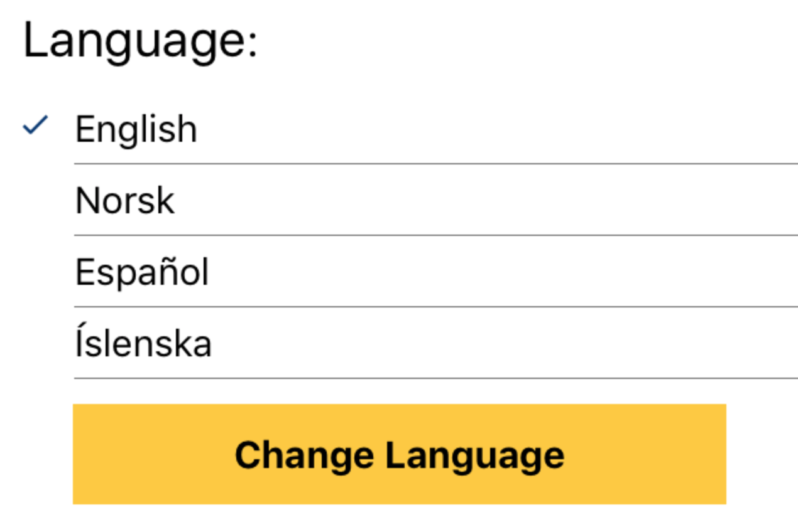

**Tl;dr**: Use NativeModules in [React Native](https://facebook.github.io/react-native/) or
[react-native-device-info](https://github.com/rebeccahughes/react-native-device-info) to get the
device language locale strings “en”, “fr”, “es”, etc.

Work on [my first React Native mobile app](http://jonrh.is/dashboard-consulting/#bd-monitor) is
nearing completion, just a few more bugs and edge cases to handle. The app is translated in 4
languages with the excellent library [i18next](https://github.com/i18next/i18next) by
[Jan Mühlemann](https://twitter.com/jamuhl).



Users of my app can change the language in the Settings view but one user experience improvement I
wanted was to have the app switch automatically according to the language specified by the
operating system. That way a Spanish speaking user would see the app translated in Spanish on first
app load.

So what I needed from React Native was a simple function or attribute to return me the locale
string from the phone. I’d then use that string to tell i18next what language to render.

The locale strings that I work with:

+ "**en**": English
+ "**nb**": Norwegian Bokmål
+ "**es**": Spanish
+ "**is**": Icelandic

However at the time of writing this functionality is not really natively supported by React Native.
It was [suggested about 1.5 years ago](https://github.com/facebook/react-native/issues/2349) but
unfortunately got nowhere. In my search I found few potential solutions suitable for different
use cases. Personally I just wanted something quick and easy without having to add any extra
third party libraries with native code.


## No libraries
```javascript
import { Platform, NativeModules } from "react-native";

let langRegionLocale = "en_US";

// If we have an Android phone
if (Platform.OS === "android") {
  langRegionLocale = NativeModules.I18nManager.localeIdentifier || "";
} else if (Platform.OS === "ios") {
  langRegionLocale = NativeModules.SettingsManager.settings.AppleLocale || "";
}

// "en_US" -> "en", "es_CL" -> "es", etc
let languageLocale = langRegionLocale.substring(0, 2); // get first two characters
```

This is the approach that I took. It requires a bit of extra work so I created a custom function
that essentially extracts the first two letters (“en”, “es”, “is”, “nb”) if they exists and do some
domain specific things for my app. This was inspired from
[this StackOverflow answer](http://stackoverflow.com/a/35493069).


## Using a native code library
The library [react-native-device-info](https://github.com/rebeccahughes/react-native-device-info)
might be suitable if there is some other device information you need. Requires third party native 
code to be linked.