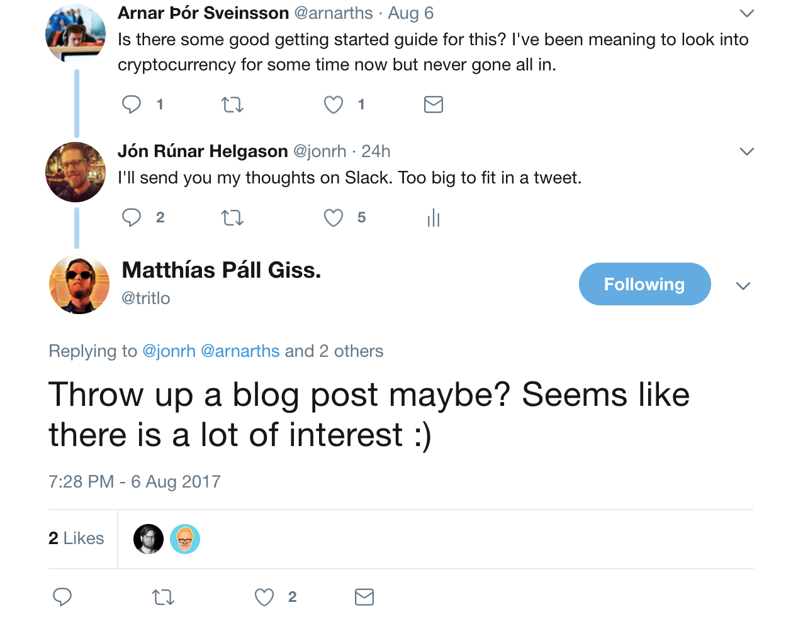

Recently, I got back into cryptocurrencies. I got interested in bitcoin around 2010/2011, did a bit
of CPU mining on my laptop (never won a block) and got ₿0.05 bitcoins for free from the Bitcoin
Faucet (now worth about ~$150). Bitcoin seemed a very enticing alternative, given I was living under
capital controls in Iceland at the time. However, bitcoin back then was super niche and the utility
had not yet materialised. With time, I lost my bitcoins and mostly forgot about them but stayed
loosely up-to-date over the years. Until now.

This blog post was put together after a few exchanges on Twitter:

### Getting Started
I recommend reading through the [getting started guide on bitcoin.org][0]. bitcoin.com also has
some decent [supporting material][1] but it seems to be a business pushing its own agenda. Roughly
speaking the process is as follows:

1. Create a [wallet][7],
2. Sign up at an [exchange][6],
3. Send fiat money to the exchange,
4. Buy cryptocurrencies on the exchange,
5. Immediately send to your wallet.

Wallets are how you securely store cryptocurrencies. There are varying types of wallets that serve
different purposes:

* **Hot**: Mobile phone wallets.
* **Cold**: Offline hardware such as [Trezor][trezor] or [Ledger][ledger].
* **Deep freeze**: Private keys or wallet recovery codes (12-24 words) printed on paper.

Hot wallets are for your daily spending. Do not store more in them than you would carry around in
cash. The wallets I would recommend the most are offline hardware wallets. Long term, the safest
option in my opinion would be laminated paper (to avoid water damage) wallets stored in fireproof
safes at a minimum of two locations. Another interesting deep-freeze option is
[engraved stainless steel][9].

**Do**:

* Use offline hardware wallets as soon as you can. It is the safest yet practical option out there.
* Write down the 12 or 24 word recovery phrase when creating a wallet. Do not skip this! It is a
way to recover your funds if your phone/hardware gets destroyed, lost, or stolen. These words
should be written down privately. Anyone with access to these words can use your money.
* Follow Andreas Antonopoulos on [Twitter][4] and especially [YouTube][5]. He is incredibly good at
explaining bitcoin in simple terms.
* Be paranoid. You can probably not be paranoid enough.

**Do not**:

* Use a wallet on your personal computer. It is simply not secure enough.
* Keep fiat nor cryptocurrencies on exchanges. Exchanges get [robbed][2] and [seized][3].
* Day trade cryptocurrencies unless you know what you are doing.
* Worry too much about when to buy. [Just buy frequently over time][11] and hold.
* Mine cryptocurrencies for profit unless you know what you are doing. Mostly profitable on special
hardware in datacenters.

### What I do

* **Exchange**: Kraken.
* **Hot wallets**: Jaxx & Copay until I get my Ledger Nano S.
* **Cold wallet**: Ledger Nano S (on backorder).

I look at bitcoin as a long term (5-30 years) storage of value: digital gold. Transaction fees can
range from €0.5 to €4, so the only thing I will do with bitcoins is to hold on to them, buy other
cryptocurrencies and maybe take part in [ICOs][8]. I will look into other currencies for utility,
like buying and trading things.

I do not hold any allegiance to any specific cryptocurrencies. My strategy so far is more or less
to "buy into crypto". That means I split roughly on total [market capitalisation][10] of each coin:

* Bitcoin: 60%
* Ethereum: 20%
* Alt coins: 20% (litecoin, etc) 

Personally I do keep a maximum of €200 on Kraken. I accept the risk of losing it but in return I
have the option to buy more on short notice (when price drops). Furthermore, I never invest more
into cryptocurrencies than I would be okay with loosing entirely. A hard earned lesson from the
2008 financial crash in Iceland.

[0]: https://bitcoin.org/en/getting-started
[1]: https://www.bitcoin.com/getting-started/
[2]: https://en.wikipedia.org/wiki/Mt._Gox
[3]: https://en.wikipedia.org/wiki/BTC-e
[4]: https://twitter.com/aantonop
[5]: https://www.youtube.com/user/aantonop
[6]: https://bitcoin.org/en/exchanges
[7]: https://bitcoin.org/en/choose-your-wallet
[8]: https://en.wikipedia.org/wiki/Initial_coin_offering
[9]: https://cryptosteel.com/
[10]: https://coinmarketcap.com/charts/
[11]: https://en.wikipedia.org/wiki/Dollar_cost_averaging
[trezor]: https://trezor.io/
[ledger]: https://www.ledgerwallet.com/products/ledger-nano-s

