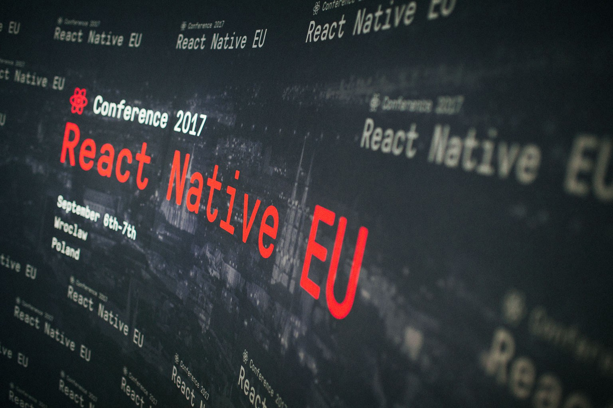
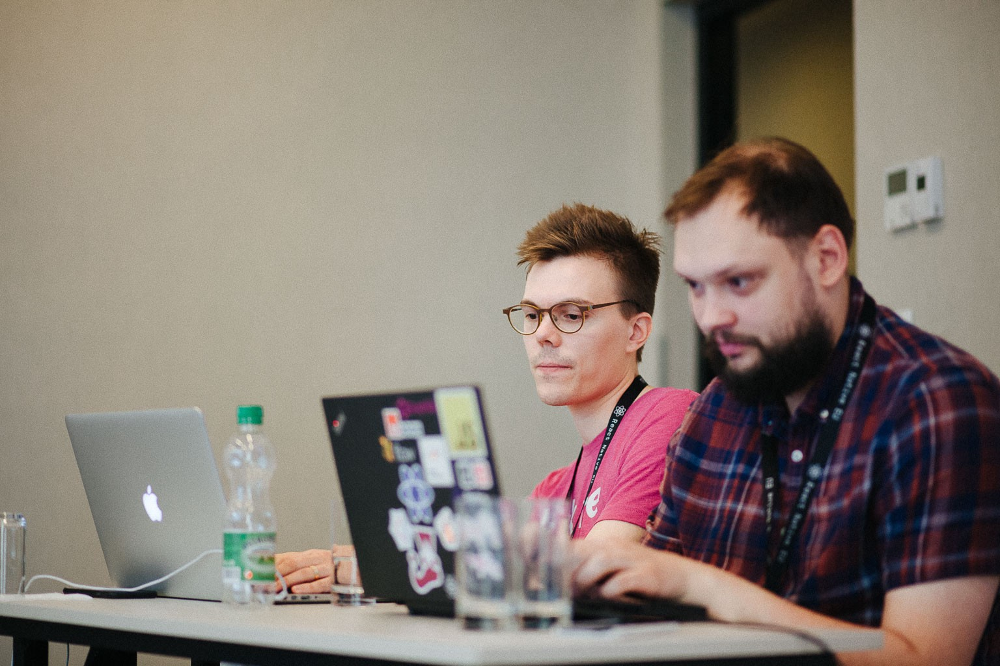
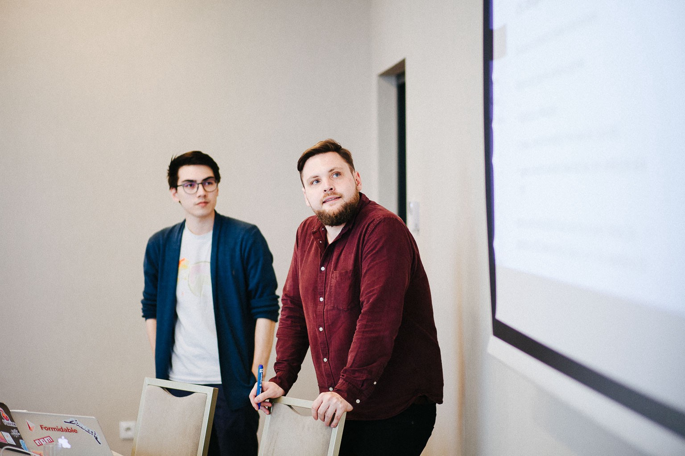
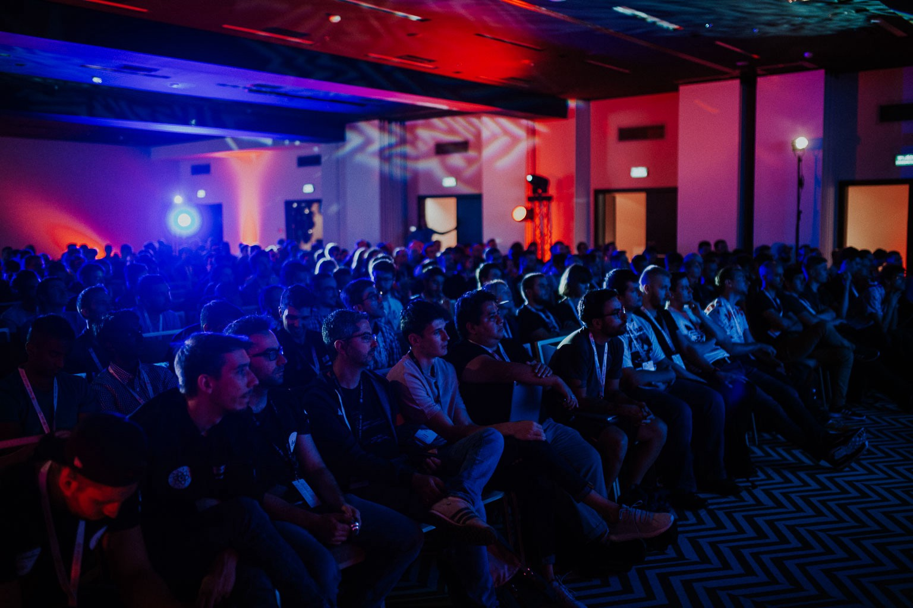
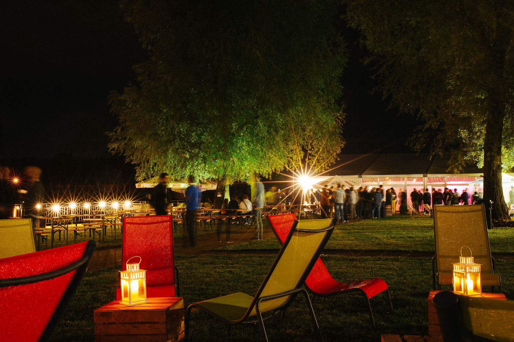
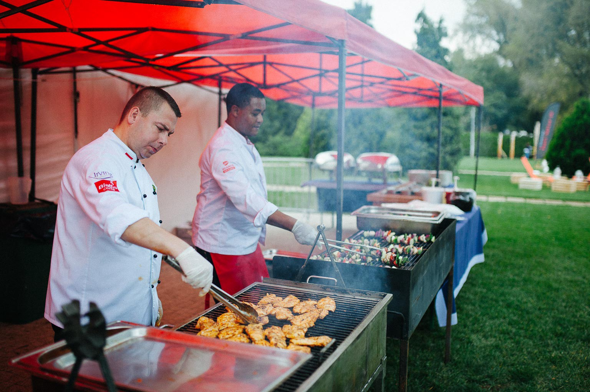
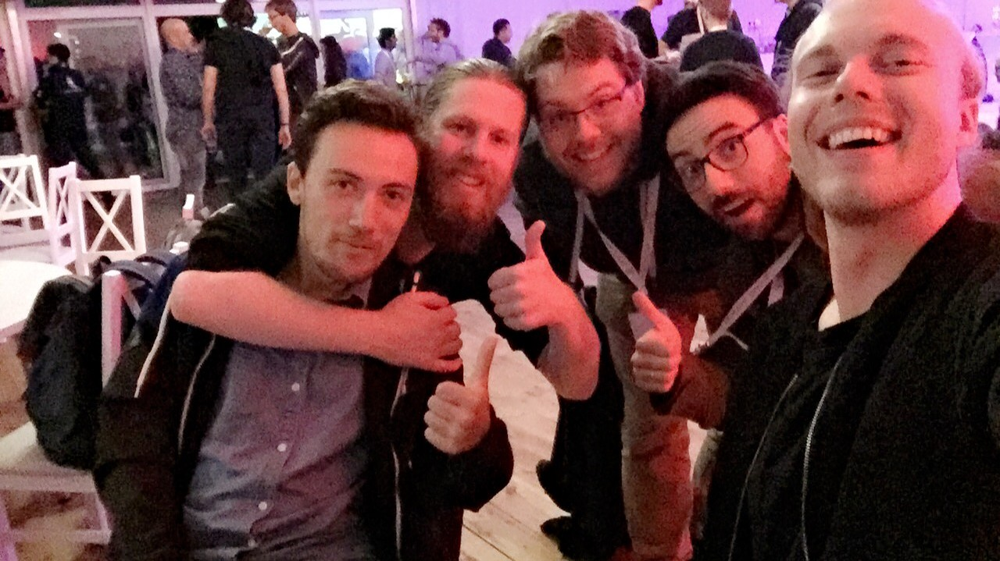
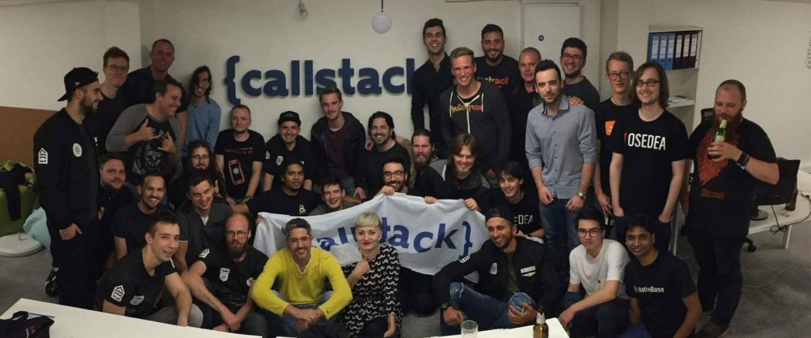

Between September 4. - 7. I attended the first [React Native conference](https://react-native.eu/), held in the charming city of Wrocław (pronounced *vrots-waff*) in Poland. I decided to go pretty much as soon as tickets were available for sale. I was able to acquire super early bird tickets for €200 and the workshop ticket was €170.

Poland and Wrocław really surprised me in a good way, great food and night life. Really affordable, for example a beer at a bar was €1-2 compared to the €5 that I'm used to in Ireland. Really loved pierogi and steak tartare (raw minced beef with a raw egg yolk). I was very pleased to have my Poland stereotype busted. A nice place I hope to visit again.

## Workshops

Me at the workshop.

Due to flight rescheduling I was unfortunately not able to make it to the first day of the workshops. On the second day I attended *Track I* which covered *GraphQL* with [Ville Immonen][ville] & [Mikhail Novikov][mikhail].

Ville & Mikhail.

The second workshop of the day was *Animation and Interaction* by [Phil Plückthun][phil] & [Jani Eväkallio][jani]. Before the workshop I had always shied away from animations and interactions, thinking they were too complicated. It was brilliant to be shown wrong. To animate or make things interactive you essentially wrap your views with components and tweak some number props until things look & feel nice.

Phil & Jani.

The workshops generally used Expo which was a perfect fit to get things up and running quickly on the mobile devices. Below are GitHub links to the material of each workshop that you can work on in your own time:

* [Navigation in React Native][navigationworkshop]
* [Universal React][universalworkshop]
* [Animation and Interaction][animationworkshop]
* [Using GraphQL with React Native][graphqlworkshop]

## Talks
All the talks are available on YouTube on the [React Native EU channel](https://www.youtube.com/channel/UCUNE_g1mQPuyW975WjgjYxA/videos).

<!--I had been following most of the speakers on Twitter and was already familiar with some of their work. The types of talks I generally favour are stories of experience. For example how was the React Native experience at a company, what worked well, what were the challenges and how were they solved.-->

My favourite talks in no specific order:

* **[Tal Kol][tal]**: *[Going Over The Speed Limit - Synchronous Rendering in React Native][taltalk]*. React rendering is by design asynchronous. That's great for the most part but native mobile does it synchronously. In this talk Tal gave us insights into the pros & cons of going synchronous to get that buttery smooth native performance.

* **[Jani Eväkallio][jani]**: *[When “Good Enough” Just Isn’t Good Enough][janitalk]*. React Native brought to the table a lot of great things and it has been evolving at a great speed. However for React Native not to become the next PhoneGap the community should heed more attention to improving the native UX and worry less about behind the scene things like state management. Jani makes the case that React Native developers ought to dual wield iPhones and Androids to *really* understand the UX language of both platforms.

* **[André Staltz][andre]**: *[Composable Native APIs][andretalk]*. One of the main attraction of React is that components are declarative which makes composing UI a breeze. However in React Native some native APIs are very much imperative. André shows how he applied the Cycle.js hexagonal architecture to React Native to make native APIs more composable.

* **[Eric Vincenti][eric]**: *[Practical hacks for delightful interactions][erictalk]*. Eric shows three practical hacks to take interactions to the next level: animate on the UI thread, work around interaction lifecycles, use `ScrollView` for gesture handling.

* **[Eloy Durán][eloy]**: *[Integrating React Native into an existing native codebase][eloytalk]*. With React Native maintenance and onboarding became easier for Artsy. It provided a simpler mental model (compared to MVC and MVVM), simpler and more efficient networking, de-siloed people, improved DX and an expansion to an Android app became more feasible. React Native was brought into the app via a CocoaPods wrapper package and included in the main app. This meant that the native iOS app could be worked on independently of React Native code.

## Dinner Party
The highlight of the conference for me was the the dinner party. Callstack leased a beautiful outdoor venue by the river with booze and a marvellous selection of grilled food.

The event started at 18:00 and the last few people left at 01:00. This was the perfect environment to have great conversations and to really get to know people. In fact, this was the primary reason why I went, to meet the people.

Dinner party. Photo by Emil Lindell.

Afterparty at Callstack's office. [Photo](https://twitter.com/annalankauf/status/905872231544352768) by Anna Lankauf.

## Conclusion
I have to say that I (everyone) was seriously impressed with the expert job that Callstack did at organising the conference.

* Schedule was on time.
* All talks were recorded and uploaded.
* Chill room with comfortable lean back chairs.
* No questions after each talk. 
* Ibis Style Hotel catering was excellent, good lunch, drinks, and snacks available throughout the day.

If I'm still working with React Native after about a year I will for sure try to attend React Native Europe 2018 in Wrocław.

*Photos taken from the [React Native EU 2017 photo gallery](https://blog.callstack.io/react-native-eu-2017-photos-1e0a7b032802)*.

[tal]: https://twitter.com/koltal
[taltalk]: https://www.youtube.com/watch?v=HXKFQu2cP4c
[jani]: https://twitter.com/jevakallio
[janitalk]: https://www.youtube.com/watch?v=A8fbdZpHESo
[andre]: https://twitter.com/andrestaltz
[andretalk]: https://www.youtube.com/watch?v=YnRALIjnRM4
[eric]: https://twitter.com/EricVicenti
[erictalk]: https://www.youtube.com/watch?v=7emqc7yf-Zg
[eloy]: https://twitter.com/alloy
[eloytalk]: https://www.youtube.com/watch?v=MbHBacYlHKQ
[ville]: https://twitter.com/VilleImmonen
[mikhail]: https://twitter.com/freiksenet
[phil]: https://twitter.com/_philpl
[animationworkshop]: https://github.com/FormidableLabs/react-native-animation-workshop
[navigationworkshop]: https://github.com/callstack/workshop-navigation
[graphqlworkshop]: https://github.com/reindexio/react-native-graphql-workshop
[universalworkshop]: https://github.com/callstack/talk-universal-react
